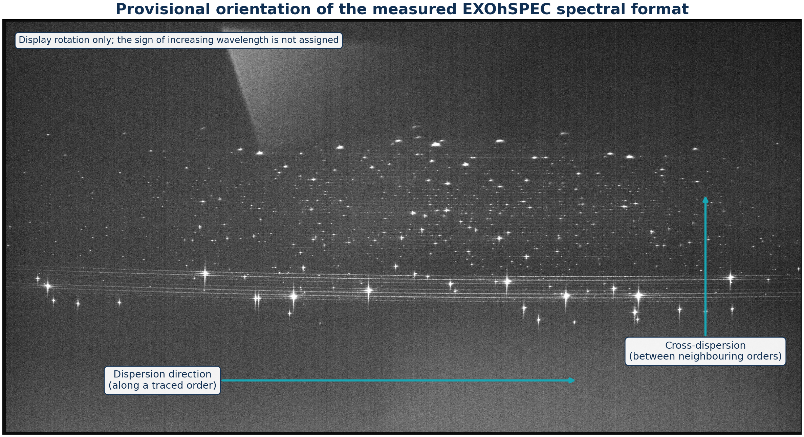
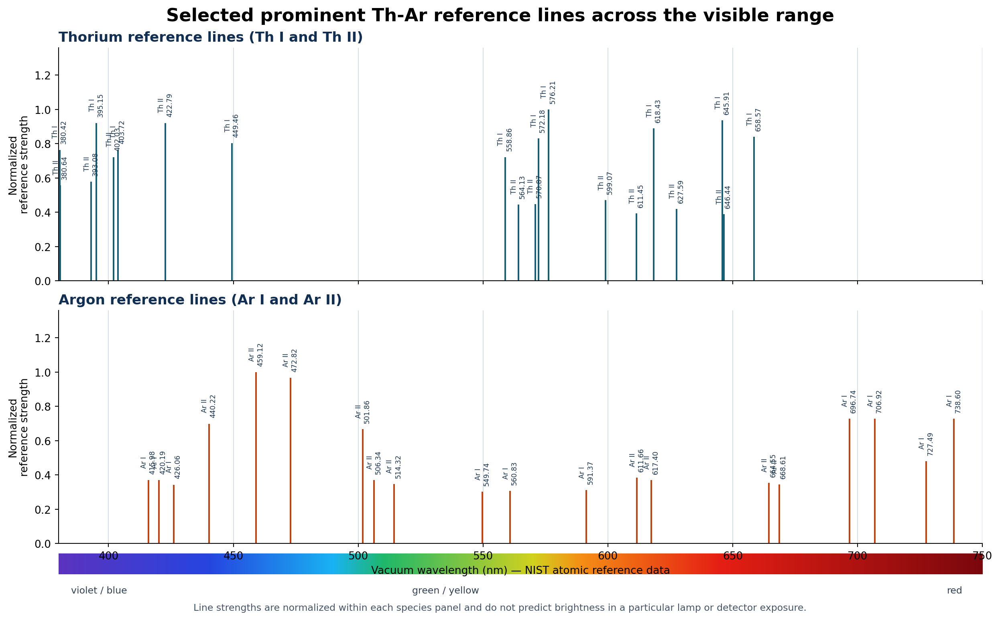
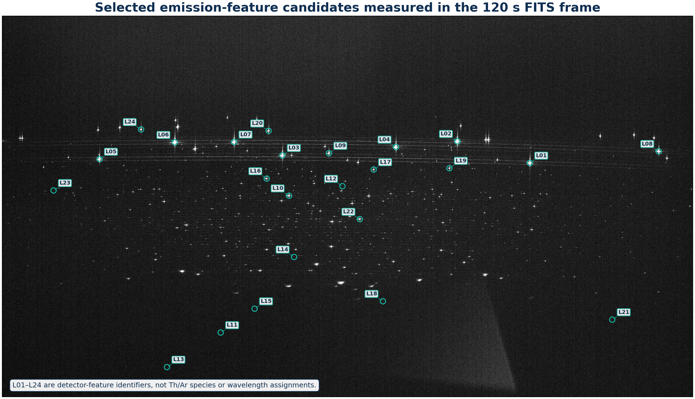
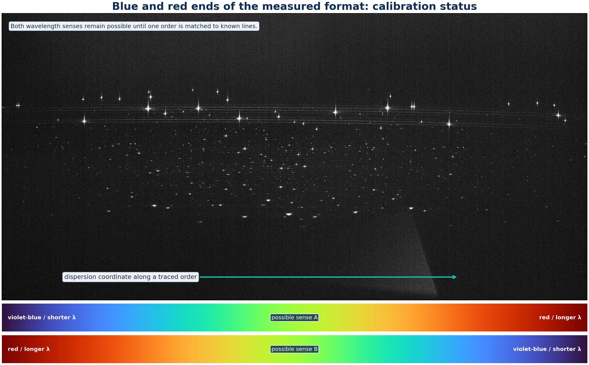

# Thorium-Argon Spectral Lines

[](https://biswajit1999.github.io/exohspec-thar-atlas/)
[](https://github.com/Biswajit1999/exohspec-thar-atlas/actions/workflows/pages.yml)

[](LICENSE)

A scientific introduction to the thorium-argon hollow-cathode spectrum, using
four privacy-reviewed FITS exposures recorded during practical work on the
EXOhSPEC project.

**[Read the illustrated report](https://biswajit1999.github.io/exohspec-thar-atlas/)**



## Introduction

This project began after recording thorium-argon lamp spectra with exposure
times of 30, 60, 120, and 180 seconds. The dense field of bright features led
to several questions: what produces these lines, which transitions belong to
thorium or argon, why are some much brighter than others, and why is this source
important in astronomical spectroscopy?

A Th-Ar lamp is an emission source. An electrical discharge in low-pressure
argon creates ions and energetic electrons. Argon ions bombard the
thorium-bearing cathode, releasing thorium atoms by sputtering. Excited neutral
and ionized atoms then emit photons at discrete energies. These appear as
narrow bright lines rather than the dark deficits seen in absorption spectra.

Thorium supplies a dense forest of lines across the optical spectrum. Argon
sustains the discharge and contributes its own lines, including several strong
red and near-infrared features. The combination provides many reference
wavelengths for mapping detector position onto physical wavelength.

## Thorium and argon reference lines



The reference guide separates **Th I and Th II** from **Ar I and Ar II**.
Roman numeral I means a neutral atom and II means a singly ionized atom. The
left side is the shorter-wavelength violet/blue region; wavelength increases
toward the red side on the right.

The selected wavelengths come from the NIST Atomic Spectra Database. Strengths
are normalized separately within the thorium and argon panels, so their heights
show prominent reference features but do not predict their brightness in this
particular lamp exposure. Lamp current, pressure, optical throughput, detector
sensitivity, and saturation all affect measured intensity.

The supplied FITS frames do not contain a validated wavelength solution.
Therefore, the NIST species names are shown in a separate reference plot and
are not attached to individual detector spots. That distinction prevents an
uncalibrated bright feature from being incorrectly called thorium or argon.

## Lines marked in the 120-second FITS frame



Python detects and marks 24 strong, spatially separated features in the
120-second frame. The labels L01–L24 are stable detector-feature identifiers,
not atomic names. Their normalized positions and relative peak signals are
published in
[the measured-candidate table](data/derived/measured-line-candidates-120s.csv).
Assigning a wavelength and a Th I, Th II, Ar I, or Ar II identity requires an
order trace and a matched dispersion solution.



The detector establishes the axis along which wavelength changes, but not
which end is blue or red. The FITS header contains no wavelength calibration,
so the two mirror directions remain possible. A known line/order match chooses
the correct sense; after that, the NIST reference wavelengths above can be
fitted to detector centroids.

## What was measured from the four FITS images

The Python analysis reads the two-dimensional FITS arrays, applies FITS scaling,
estimates the detector background, counts bright and near-ceiling pixels,
compares integrated response, measures translational registration, constructs
an HDR signal-rate image, finds candidate features, and extracts representative
detector-space profiles.

| Exposure | Median background | Robust sigma | Bright pixels | Pixels >= 60,000 ADU | Signal / 30 s |
|---:|---:|---:|---:|---:|---:|
| 30 s | 502 ADU | 2.965 ADU | 6,267 | 1 | 1.00000 |
| 60 s | 504 ADU | 4.448 ADU | 10,906 | 15 | 1.97961 |
| 120 s | 505 ADU | 4.448 ADU | 17,998 | 75 | 4.01202 |
| 180 s | 508 ADU | 4.448 ADU | 26,132 | 121 | 5.84104 |

The common unsaturated response gives **R² = 0.999276**, with a maximum
fractional residual of **1.994%**. The largest estimated translation relative
to the 120-second frame is **0.071 native pixel** under the stated
translation-only model. The 120-second exposure is the clearest single-frame
compromise in this sequence; the shorter frame protects strong cores and the
longer frame reveals more faint structure.


The large peaks and smaller fluctuations in these profiles come from the FITS
data. Their lower axis is normalized detector position. The upper axis names
the corresponding wavelength parameter λ(x,m), but numerical wavelengths are
not invented where no calibrated pixel-to-wavelength mapping is available.

## Scientific importance and applications

Thorium-argon spectra are used for:

- absolute wavelength calibration of spectrographs;
- monitoring movement and drift of the spectral format;
- supporting radial-velocity measurements;
- checking order tracing, extraction, focus, and line shape;
- providing absolute anchors alongside Fabry-Pérot etalons or frequency combs.

In exoplanet work the lamp does not detect a planet directly. It establishes the
wavelength coordinate needed before a small stellar Doppler shift or planetary
atmospheric signal can be interpreted.

## Project files

- [Interactive report](https://biswajit1999.github.io/exohspec-thar-atlas/)
- [Technical report](report/technical-report.md)
- [PDF report](output/pdf/exohspec-thar-detector-study.pdf)
- [NIST reference-line subset](data/derived/nist-visible-reference-lines.csv)
- [Measured 120 s feature table](data/derived/measured-line-candidates-120s.csv)
- [Analysis methodology](docs/methodology.md)
- [`src/exohspec_thar`](src/exohspec_thar): FITS and numerical analysis
- [`scripts`](scripts): analysis, plotting, and report builders
- [`tests`](tests): numerical and privacy-contract tests

## Reproduce the analysis

```bash
python -m pip install -e ".[dev,reference]"
python scripts/build_products.py ThAr_30sec.fit ThAr_60sec.fit \
  ThAr_120sec.fit ThAr_180sec.fit --output-root .
python scripts/build_science_report.py ThAr_30sec.fit ThAr_60sec.fit \
  ThAr_120sec.fit ThAr_180sec.fit --output-root .
python scripts/build_reference_line_guide.py
python scripts/build_explanatory_figures.py
python scripts/build_pdf_report.py
pytest
```

Run `python scripts/build_reference_line_guide.py --refresh` to refresh the
selected visible-range reference wavelengths from NIST ASD.

## Data boundary

The public repository includes normalized coordinates, aggregate measurements,
reference wavelengths, analysis code, and display-ready derivatives. Raw FITS
files, full headers, exact detector geometry, serial information, optical
prescriptions, and laboratory layout are intentionally excluded. The two lamp
illustrations are clearly marked conceptual images and are not measured data.

## Acknowledgements

During practical laboratory work on the EXOhSPEC project, **Biswajit Jana**
recorded several thorium-argon spectra and became interested in what the bright
lines represent, how they are produced, and why they are useful. That curiosity
led to this analysis and educational report. The author gratefully acknowledges
**Prof. Hugh Jones** for supervision of the EXOhSPEC work and **Prof. Bill
Martin** for guidance and supervision during the optics laboratory work at the
University of Hertfordshire.

## Citation and sources

Citation metadata are provided in [CITATION.cff](CITATION.cff). Atomic
wavelengths are sourced from the
[NIST Atomic Spectra Database](https://physics.nist.gov/asd) and NIST SRD 161.
Code and original explanatory text are released under the MIT License.
