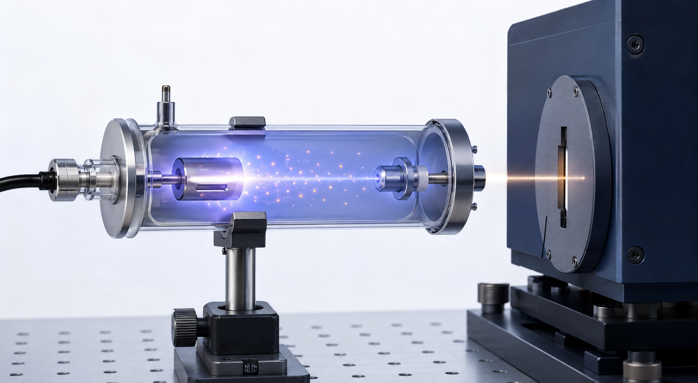
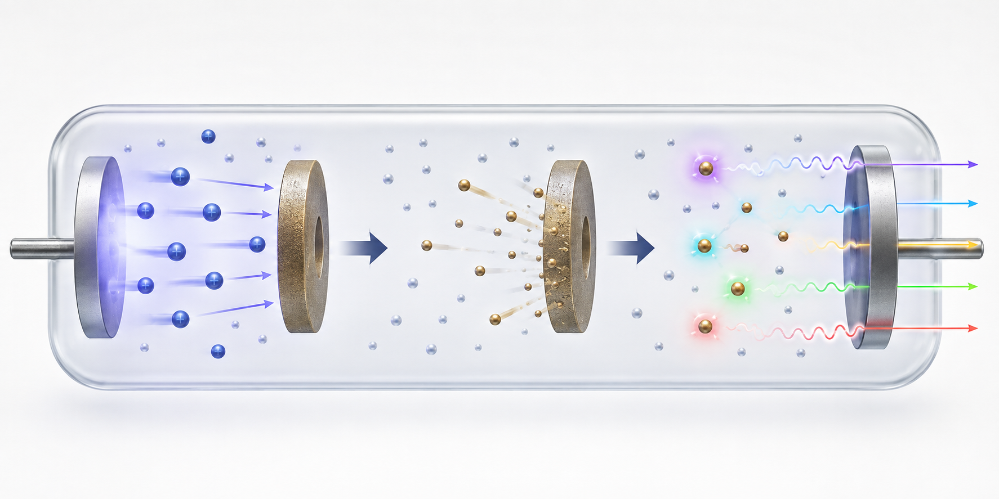
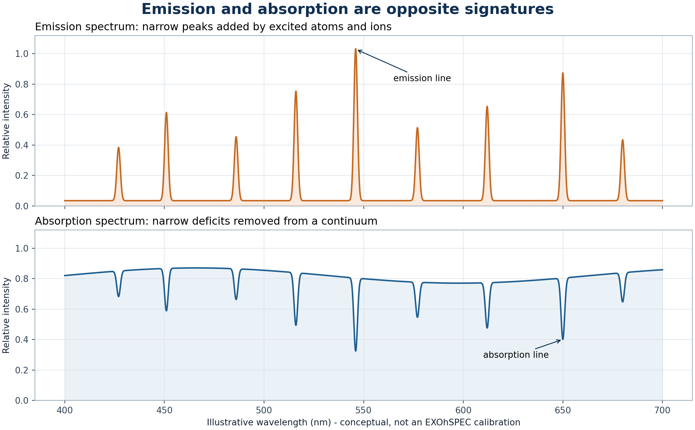
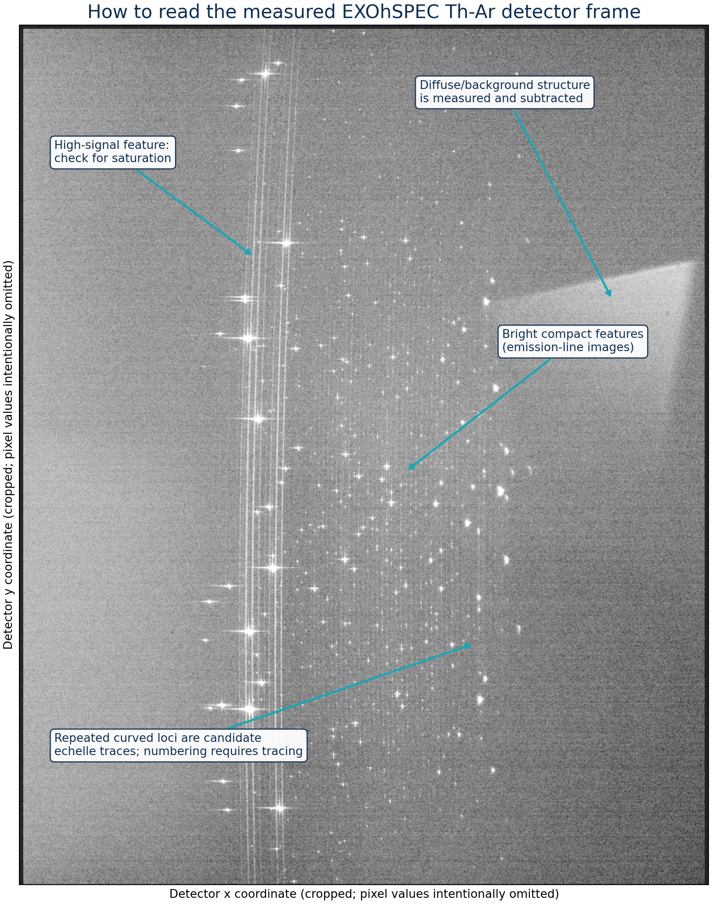
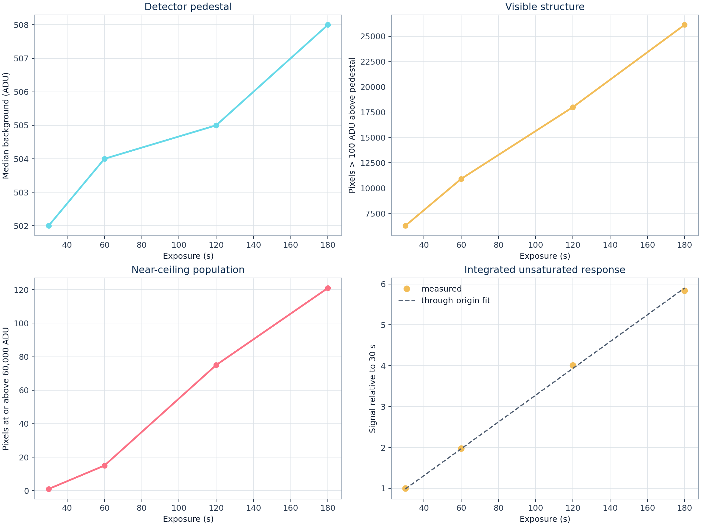
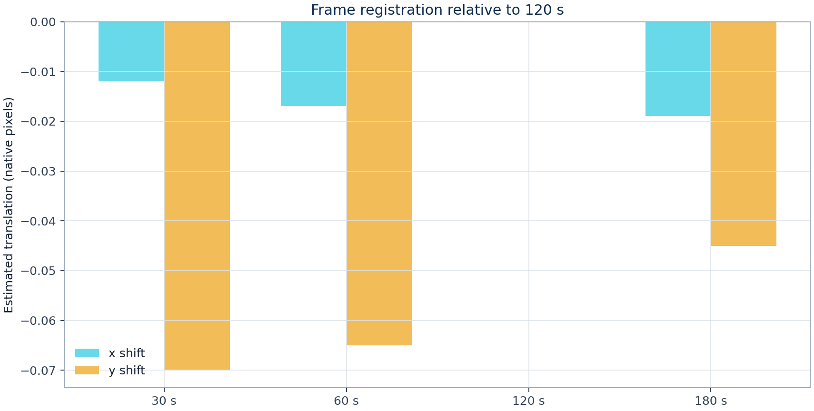
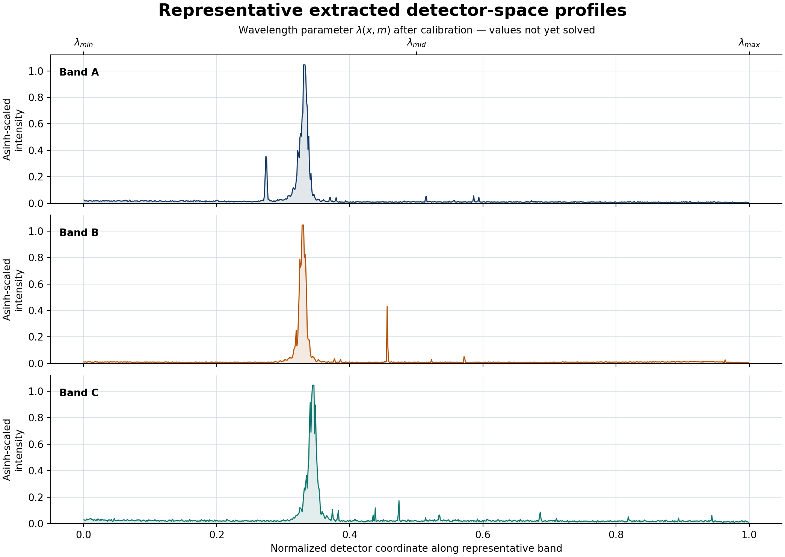

# Detector-domain characterization of thorium-argon calibration exposures recorded with EXOhSPEC

**Biswajit Jana**  
EXOhSPEC instrumentation study, University of Hertfordshire  
Data release 0.2 — September 2026

## Abstract

Thorium-argon (Th-Ar) hollow-cathode lamps are long-established wavelength references for astronomical spectrographs because they produce a dense forest of narrow, repeatable emission features. This report presents a detector-domain study of four Th-Ar exposures recorded with EXOhSPEC using a ZWO CMOS-family detector. Exposure times of 30, 60, 120, and 180 seconds are compared without publishing raw FITS files, full headers, exact detector geometry, or laboratory optical details. The analysis measures the background pedestal, robust scatter, population of bright and near-ceiling pixels, integrated response on a common unsaturated mask, translational registration, and the contribution of each exposure to a high-dynamic-range (HDR) signal-rate composite.

The unsaturated integrated response is highly linear with exposure time, with a through-origin coefficient of determination of **R² = 0.999276** and a maximum fractional residual of **1.994%**. The number of pixels at or above 60,000 ADU increases from **1** at 30 s to **121** at 180 s. Phase correlation gives a maximum estimated translation of **0.071 native pixel** relative to the 120 s exposure under a translation-only model. These measurements support **120 s as the preferred single exposure** for this data set: it reveals much more faint structure than the shorter integrations while retaining more bright-line headroom than 180 s. For display and detector-domain feature finding, an HDR estimator is superior because it uses the longest valid exposure at every pixel and replaces near-ceiling values with shorter integrations.

This release deliberately does **not** assign atomic species, echelle order numbers, or wavelengths. Such labels require a validated trace model, one-dimensional extraction, reference-line matching, a dispersion solution, and residual analysis. The report therefore distinguishes measurements from interpretations and uses normalized detector coordinates wherever a wavelength axis would be premature.

**Keywords:** thorium-argon, hollow-cathode lamp, echelle spectroscopy, wavelength calibration, EXOhSPEC, CMOS detector, exposure optimization, high dynamic range

## 1. Purpose and scope

The project has two connected goals. The first is educational: explain what a Th-Ar source is, why its spectrum consists of emission lines, why thorium and argon are used, where the materials occur, and how such lamps support astronomical spectroscopy. The second is experimental: show what can be learned from the supplied EXOhSPEC exposure sequence before a complete wavelength solution exists.

The central question is practical: **is a 120-second exposure sufficient, and what is gained by also recording 30, 60, and 180 seconds?** A single 120 s exposure is sufficient for a representative detector image and is the best single-frame compromise in this set. It is not sufficient to preserve the brightest cores and reveal the faintest structure simultaneously. The four-frame sequence remains valuable because the 30 s frame protects bright-core information and the 180 s frame extends faint-feature visibility.

This is a public, privacy-reviewed release. It identifies the instrument as EXOhSPEC and the detector only as a ZWO CMOS-family device. It omits exact hardware configuration, optical prescriptions, laboratory layout, raw detector dimensions, full headers, file paths, and raw data.

## 2. What is a thorium-argon lamp?

A Th-Ar lamp is a hollow-cathode discharge source. The cathode contains thorium, and the fill gas is argon at low pressure. Applying a voltage accelerates charged particles through the gas. Argon ions bombard the cathode and sputter thorium atoms into the discharge. Collisions excite neutral and ionized thorium and argon. When those excited states relax, they emit photons at discrete energies and therefore at discrete wavelengths.



**Figure 1a.** AI-generated conceptual illustration of a Th-Ar hollow-cathode source feeding a generic spectrograph entrance. It is not a photograph, engineering drawing, or depiction of the private EXOhSPEC laboratory.

### 2.1 Inside the discharge

The fill gas is essential: it allows an electrical discharge to be established at a pressure where charged particles can accelerate between collisions. Positive argon ions are drawn toward the cathode. Their impact transfers momentum to the cathode surface, releasing thorium atoms by sputtering. Electrons and ions then collide with both argon and thorium species. Some collisions ionize an atom; others lift an electron into an excited bound state.



**Figure 1b.** AI-generated conceptual sequence: argon ion bombardment, thorium sputtering, excitation, and emission of photons at discrete energies. The artwork is explanatory rather than a literal cross-section.

### 2.2 Energy levels and discrete lines

Atomic electrons occupy quantized states. A radiative transition from upper energy \(E_u\) to lower energy \(E_l\) produces a photon satisfying

\[
E_u-E_l=h\nu=\frac{hc}{\lambda}.
\]

Each permitted transition therefore corresponds to a characteristic wavelength. Thorium's complex electron configuration creates a particularly dense set of transitions. In spectroscopic notation, Th I is neutral thorium, Th II is singly ionized thorium, and Th III is doubly ionized thorium; Ar I, Ar II, and Ar III use the same convention for argon. Roman numerals describe charge state, not brightness.

The result is a line-rich **emission spectrum**. It differs fundamentally from a stellar absorption spectrum. An emission line is a narrow positive peak above the local background because the source adds photons at a transition wavelength. An absorption line is a narrow deficit below a continuum because intervening material removes photons at a transition wavelength. Th-Ar lamps are useful as spectrograph rulers because their emission-line wavelengths can be measured independently at high precision.



**Figure 1c.** Conceptual comparison of emission and absorption signatures. The wavelength values are illustrative and are not EXOhSPEC line identifications.

### 2.3 Why brightness alone cannot identify a species

Line intensity changes with lamp current, gas pressure, cathode condition, warm-up time, age, optical throughput, blaze efficiency, detector sensitivity, and exposure duration. NIST explicitly cautions that atlas intensities depend strongly on lamp operating conditions. A strong peak in the EXOhSPEC frame is therefore not automatically argon, and a weak peak is not automatically thorium. Species identification must be based on wavelength agreement, line isolation, and consistency with a global dispersion solution.

### 2.4 Blends and the instrumental line profile

The detector does not record an infinitely narrow atomic transition. It records the transition convolved with the spectrograph line-spread function and sampled by pixels. Two nearby transitions can form a blend. A saturated feature can flatten, broaden, or acquire an unreliable centroid. Scattered light changes the local baseline, while asymmetry in the instrumental profile can shift a simple Gaussian fit. High-quality wavelength calibration selects isolated, unsaturated features or explicitly models these effects.

## 3. Why thorium and argon are useful

### 3.1 Thorium as the dense wavelength ruler

Thorium produces many narrow optical and near-infrared transitions. NIST Standard Reference Database 161 provides reference wavelengths for more than 20,000 Th I, Th II, and Th III features together with argon line lists. Redman, Nave, and Sansonetti reported 19,646 thorium lines and optimized energy levels spanning a much wider wavelength interval than a single optical spectrograph records.

Thorium also has a comparatively simple terrestrial isotopic composition. The dominant isotope is ²³²Th, whose half-life is approximately 1.40 × 10¹⁰ years. Isotopic simplicity reduces one source of spectral substructure, although blends, pressure shifts, lamp ageing, illumination changes, and instrument effects still require careful treatment.

### 3.2 Argon as the discharge gas

Argon supports a stable electrical discharge and contributes its own Ar I, Ar II, and Ar III emission. These lines can assist acquisition and calibration, but some are much brighter than nearby thorium features. The large intensity range creates a detector problem: an exposure long enough to show faint thorium lines may push strong argon or thorium features toward the detector ceiling. The supplied exposure ladder displays this trade directly.

### 3.3 Abundance and availability

Thorium is a naturally occurring lithophile element distributed in crustal minerals. The US Geological Survey gives an estimated abundance near 10.5 mg kg⁻¹ in the upper continental crust and discusses monazite as an important thorium-bearing mineral. Natural abundance does not make thorium handling trivial: it is radioactive and any lamp acquisition, use, storage, and disposal must follow institutional and regulatory controls.

Argon is comparatively abundant and accessible. NOAA gives argon as approximately 0.934% by volume of dry air. Atmospheric argon is dominated by ⁴⁰Ar. Material abundance alone does not determine suitability for calibration; the decisive properties are spectral line density, accuracy of reference wavelengths, usable intensity distribution, lamp stability, and compatibility with the spectrograph.

## 4. Astronomical applications

Th-Ar exposures establish a mapping from detector position to wavelength, monitor changes in a spectrograph, and diagnose the two-dimensional spectral format. Once calibrated, the spectrum can support:

1. **Absolute wavelength calibration.** Measured feature centroids are matched to laboratory reference wavelengths.
2. **Instrument drift monitoring.** Repeated lamp exposures reveal movement of the detector-space line pattern.
3. **Radial-velocity work.** A stable wavelength scale is required before small stellar Doppler shifts can be interpreted.
4. **Order tracing and extraction checks.** The dense pattern tests whether curved echelle orders are located and extracted consistently.
5. **Resolution and line-spread-function diagnostics.** Isolated, unsaturated lines can probe width, asymmetry, focus, and spatial variation.
6. **Cross-calibration.** Th-Ar absolute anchors may be combined with a Fabry-Perot etalon or laser-frequency comb, which can provide a denser or more regular relative grid.

In exoplanet spectroscopy the calibration does not measure a planet directly. It establishes the instrumental wavelength coordinate against which stellar motion or atmospheric spectral structure can be measured. Calibration uncertainty therefore propagates into the astrophysical result.

## 5. Data set and privacy boundary

The input sequence contains four two-dimensional primary FITS images:

| Exposure | Public role in this study |
|---:|---|
| 30 s | Bright-core protection and shortest-exposure reference |
| 60 s | Intermediate response check |
| 120 s | Preferred single-frame compromise |
| 180 s | Faint-feature reach and longest valid HDR source |

Only scientifically necessary, non-sensitive information is retained in public derivatives: exposure time, generic instrument and detector-family labels, normalized coordinates, aggregate counts, and display-ready images. Raw FITS data, headers, detector dimensions, equipment serials, local paths, and laboratory configuration are excluded by design. The source code enforces this boundary through a header allow-list and privacy tests.

## 6. Detector-domain methods

### 6.1 FITS ingestion and physical pixel values

The primary image is read through a memory-mapped interface. FITS scaling keywords are applied so calculations use physical unsigned detector values rather than the signed storage representation. Only exposure time is permitted to enter public output.

### 6.2 Background and robust scatter

The detector pedestal is estimated as the median of a sparse full-frame sample. Robust scatter is

\[
\sigma_\mathrm{robust}=1.4826\,\mathrm{median}\left(|x-\mathrm{median}(x)|\right).
\]

This estimate is resistant to sparse bright features that would bias an ordinary standard deviation.

### 6.3 Public region and normalized coordinates

A feature-rich region is found from bright-pixel coordinate percentiles and padded. Published plots omit the raw pixel extent and use normalized detector coordinates. This retains morphology while avoiding unnecessary disclosure of exact geometry.

### 6.4 Common unsaturated response mask

The 180 s pedestal-subtracted signal-rate image defines a common source mask. Pixels above a conservative feature threshold are morphologically dilated to include the local point-spread footprint. A pixel is retained for the linearity test only if every exposure remains below 55,000 ADU.

For exposure time \(t_i\), the integrated signal is

\[
S_i=\sum_{(x,y)\in M}\max\left[I_i(x,y)-B_i,0\right],
\]

where \(M\) is the common unsaturated mask and \(B_i\) is the measured background pedestal.

### 6.5 Through-origin response model

The normalized integrated measurements are fitted with \(S(t)=a t\). A through-origin model is appropriate for pedestal-subtracted counts from a source assumed stable over the sequence. The fit is a response diagnostic rather than a complete detector-linearity calibration; it does not independently constrain shutter timing, reciprocity, gain, or lamp-current stability.

### 6.6 Registration

Each pedestal-subtracted frame is block averaged, transformed with \(\log(1+x)\), and compared with the 120 s reference through phase correlation. Parabolic interpolation around the correlation maximum gives a sub-pixel translation estimate. The model measures global x-y translation only. It does not fit rotation, scale, optical distortion, local order motion, or uncertainty from repeated acquisitions.

### 6.7 HDR signal-rate estimator

At each pixel, the estimator selects the longest exposure below 60,000 ADU and converts its pedestal-subtracted signal into a rate:

\[
R(x,y)=\frac{I_{t^*}(x,y)-B_{t^*}}{t^*},
\]

where \(t^*\) is the longest valid exposure for that location. The HDR image is a visualization and feature-finding product, not an absolutely calibrated radiance image.

### 6.8 Morphological feature candidates

Mild Gaussian smoothing is followed by a local-maximum filter and a high-percentile threshold. The 500 strongest separated candidates are retained for visualization. These points are **morphological candidates**, not a catalogue of 500 Th-Ar atomic lines. A single transition can produce more than one detector-space maximum, and noise, blends, cosmic rays, order overlap, or scattered light can create non-atomic candidates.

## 7. Reading the measured detector image

The supplied FITS frame is a two-dimensional echellogram, not a finished one-dimensional spectrum. Dispersion acts primarily along an order; cross-dispersion separates neighbouring orders. The public view below rotates the detector crop into a conventional landscape presentation so that these two roles are easier to see.


**Figure 2a.** Zoomed-out, rotated measured format with provisional dispersion and cross-dispersion directions. Rotation changes presentation only. The sign of increasing wavelength is not assigned until the optical model or a known reference feature confirms it.



**Figure 2b.** High-contrast reading guide generated from the measured HDR derivative. Bright compact features are emission-line images. Extended high-signal structures require saturation checks. Diffuse structure is part of the measured background. Repeated loci are candidate echelle traces, but order numbering requires a trace solution.

The display uses an inverse-hyperbolic-sine stretch. A linear stretch would be dominated by a small number of bright pixels and would hide most faint structure. The stretch changes display contrast only; quantitative calculations use linear detector values.

### 7.1 The visible diffuse component

The broad pale area in the upper part of the portrait view becomes a left-side diffuse feature after the landscape rotation. It is real recorded structure, but it is not by itself an atomic emission line. Plausible contributors include scattered light, illumination gradients, order wings, reflections, and other instrument-background terms. The current report subtracts a robust global pedestal for exposure comparison. A wavelength-extraction pipeline should instead fit the inter-order background locally as a smooth two-dimensional surface and propagate the background uncertainty into every extracted pixel.

### 7.2 What should be measured for each feature

For a usable line, the analysis should record centroid, integrated area, peak height, full width at half maximum, asymmetry, local background, uncertainty, saturation flag, blend flag, order number, and detector position. The centroid constrains wavelength. Width and asymmetry diagnose the line-spread function. Integrated area is often more stable than peak height for comparing unsaturated lines. None of these quantities should be taken from the display-stretched image.

## 8. Quantitative results

### 8.1 Exposure-level measurements

| Exposure | Median background (ADU) | Robust σ (ADU) | Bright pixels | Pixels ≥60,000 ADU | Integrated signal / 30 s |
|---:|---:|---:|---:|---:|---:|
| 30 s | 502 | 2.965 | 6,267 | 1 | 1.00000 |
| 60 s | 504 | 4.448 | 10,906 | 15 | 1.97961 |
| 120 s | 505 | 4.448 | 17,998 | 75 | 4.01202 |
| 180 s | 508 | 4.448 | 26,132 | 121 | 5.84104 |

The background pedestal changes by only 6 ADU from the shortest to the longest exposure. The count of pixels more than 100 ADU above the pedestal rises steadily, consistent with increasing visibility of faint structure. At the same time, the near-ceiling population grows rapidly.



**Figure 3.** Light-theme detector diagnostics: pedestal, visible structure, near-ceiling population, and common-mask integrated response.

### 8.2 Response linearity

The integrated response normalized to 30 s is close to the ideal exposure ratios 1:2:4:6. The measured values are 1.00000, 1.97961, 4.01202, and 5.84104. The largest fractional residual from the through-origin fit is 1.994%, and R² is 0.999276. The modest negative departure at 180 s is consistent with the increasing difficulty of maintaining a fully unsaturated common measurement, but this experiment alone cannot separate detector, lamp, timing, and mask-selection effects.

### 8.3 Near-ceiling behaviour

The adopted diagnostic threshold is 60,000 ADU. It is intentionally described as “near ceiling” rather than “saturated” because the actual camera saturation point and linearity limit are not disclosed or independently calibrated here. The 180 s exposure has the greatest faint-feature reach but also the largest population above this threshold. The 30 s frame is scientifically useful even though it displays fewer faint features.

### 8.4 Registration stability

Estimated shifts relative to 120 s are:

| Exposure | Δy (pixel) | Δx (pixel) | Magnitude (pixel) |
|---:|---:|---:|---:|
| 30 s | -0.070 | -0.012 | 0.071 |
| 60 s | -0.065 | -0.017 | 0.067 |
| 120 s | 0.000 | 0.000 | 0.000 |
| 180 s | -0.045 | -0.019 | 0.049 |



**Figure 4.** Phase-correlation translation estimates after four-pixel block averaging. These are algorithmic estimates, not metrology-grade uncertainties.

### 8.5 Extracted detector-space profiles



**Figure 5.** Three representative feature-rich detector bands. The x-axis is normalized detector coordinate. Profile intensity is asinh-scaled to make weak peaks visible and is not radiometrically calibrated.

These profiles are the closest scientifically defensible analogue to a conventional spectrum plot at this stage. They show narrow positive features and a broad intensity distribution, but the x coordinate cannot yet be labelled in nanometres or angstroms.

### 8.6 HDR source contributions

Within the adopted source mask, the 180 s exposure supplies 66,279 valid pixels. The estimator falls back to the 120 s frame for 49 pixels, to 60 s for 57 pixels, and to 30 s for 14 pixels. Those small fallback populations contain disproportionately important bright-core information.

## 9. Exposure recommendation

The **120 s exposure is enough for a single public-facing example and is the recommended single frame for this specific sequence**. It should not be interpreted as a universal EXOhSPEC exposure time. Lamp current, optical alignment, throughput, detector gain, temperature, binning, and the intended wavelength range can alter the optimum.

For a stronger acquisition:

- retain 120 s as the main frame;
- retain at least one short exposure, preferably 30 s, for the strongest cores;
- retain 180 s when faint-feature visibility matters;
- repeat each exposure time if uncertainty and temporal repeatability are to be estimated;
- record the calibration metadata privately even when it is not published;
- avoid increasing exposure beyond 180 s until the near-ceiling population and line-core linearity have been reviewed.

The current four exposures are sufficient for this detector-domain report. More frames would be required to measure repeatability, random uncertainty, cosmic-ray rejection, lamp warm-up behaviour, or long-term drift.

## 10. Path to a wavelength-calibrated atlas

A real Th-Ar wavelength atlas for the current EXOhSPEC format requires the following chain:

1. determine the orientation of dispersion and cross-dispersion from the instrument model and data;
2. trace the centre and width of every usable echelle order;
3. estimate and subtract local inter-order background;
4. extract one-dimensional spectra with uncertainty propagation;
5. obtain an approximate order/wavelength seed from the optical model or a previously calibrated exposure;
6. centroid isolated unsaturated features and estimate centroid uncertainties;
7. match features against NIST Th-Ar reference wavelengths within physically plausible tolerances;
8. reject blends, saturated features, unsuitable carrier-gas lines, and statistical outliers;
9. fit a two-dimensional wavelength model across pixel and order number;
10. report residuals by order, wavelength, intensity, and species;
11. validate the solution on withheld reference lines or an independent calibration source;
12. only then publish wavelength-labelled order plots and atomic identifications.

A polynomial with a small global residual can still be wrong locally. Diagnostic plots should therefore show signed residuals versus detector position, wavelength, order, and feature intensity. The line list, air/vacuum convention, wavelength units, fitting weights, clipping policy, and date/version must be recorded.

### 10.1 Reference-line provenance

NIST SRD 161 combines thorium and argon measurements from several high-resolution Fourier-transform spectra. NIST recommends optimized thorium Ritz wavelengths where appropriate, while noting that blended atlas features may need to be rejected or modelled from their Ritz components. Ar I reference values in the atlas are measured wavelengths; Ar II and Ar III include Ritz information from the cited sources. The public database covers 277–6288 nm across its constituent spectra, much wider than any one EXOhSPEC detector exposure.

The atlas is a reference library, not an automatic label overlay. Matching begins only after each order has an approximate wavelength range. A visually similar spacing pattern is insufficient because a dense line list creates accidental matches.

### 10.2 Iterative pattern matching

For a candidate feature at pixel \(x_i\), an initial model predicts \(\lambda_0(x_i,m)\) for order \(m\). Reference lines within a physically chosen search window are proposed, after which a robust global fit updates the model. Matches with large normalized residuals, saturation, blends, poor background, or inconsistent order behaviour are rejected. The process repeats with progressively narrower tolerances.

The fitting weights should combine centroid uncertainty and reference-wavelength uncertainty. A simple one-order seed may use

\[
\lambda(x)=a_0+a_1x+a_2x^2+\cdots,
\]

while the final echelle solution should couple position and order number through \(\lambda(x,m)\) or a physical model. The chosen form must be complex enough to capture the optics but not so flexible that it fits incorrect line matches.

### 10.3 Validation products

A future labelled atlas should publish, for each order, the extracted intensity, species-coded reference sticks, fitted centroids, rejected features, and a residual panel. Summary diagnostics should include line count per order, RMS and robust residuals, maximum residual, residual maps versus position and wavelength, the air/vacuum convention, line-list version, polynomial form, clipping rule, and performance on lines withheld from fitting. Only then should the two-dimensional detector overview carry order numbers and a verified wavelength-increase arrow.

## 11. Limitations

- One exposure is available at each integration time, so repeatability at fixed exposure cannot be estimated.
- The response fit assumes stable lamp output during the sequence.
- The registration model fits only a global translation.
- Near-ceiling counts use an adopted threshold, not an independently measured linearity boundary.
- Background estimation is robust but simplified; a full pipeline would model local scattered light between orders.
- Feature finding identifies morphology, not atomic transitions.
- Public normalization and cropping limit detector-level reproducibility by design; the investigator retains the private raw data.
- No claim is made about absolute flux, resolving power, line-spread function, or radial-velocity precision.

These limits do not invalidate the exposure comparison. They define which conclusions the data support and which require the next calibration stage.

## 12. Reproducibility

The repository includes a dependency-light FITS reader, analysis code, figure generation, tests, privacy controls, and the static website. Raw inputs remain local and ignored by Git.

```bash
python -m pip install -e ".[dev]"
python scripts/build_products.py ThAr_30sec.fit ThAr_60sec.fit ThAr_120sec.fit ThAr_180sec.fit --output-root .
python scripts/build_science_report.py ThAr_30sec.fit ThAr_60sec.fit ThAr_120sec.fit ThAr_180sec.fit --output-root .
python scripts/build_explanatory_figures.py
pytest
```

## 13. Conclusions

The supplied EXOhSPEC sequence is scientifically useful and sufficient for a high-level public report. It demonstrates the defining feature of a Th-Ar lamp—a dense emission-line field—and quantifies the exposure trade between faint-feature reach and bright-core headroom. The detector response is close to proportional over 30–180 s on a common unsaturated mask, and the global image registration is stable under the stated model.

The strongest practical conclusion is simple: **use 120 s when only one frame can be shown, but retain the full 30–180 s ladder for HDR analysis and bright-core protection.** The strongest methodological conclusion is equally important: detector peaks should not be given atomic names or wavelengths until order tracing and the wavelength solution have been validated.

## Acknowledgements

This work was carried out by **Biswajit Jana** in the context of EXOhSPEC instrumentation research. The author acknowledges **Prof. Hugh Jones** for supervision of the EXOhSPEC research and **Prof. Bill Martin** for supervision of the optics and laboratory work at the University of Hertfordshire.

## References

1. Lhospice, E. et al. (2019). *EXOhSPEC folded design optimization and performance estimation*. Proceedings of SPIE. <https://uhra.herts.ac.uk/id/eprint/14227/1/20190626_ProcSPIE_EXOhSPEC_V3.pdf>
2. University of Hertfordshire. *EXOhSPEC project page*. <https://star.herts.ac.uk/exohspec/>
3. Nave, G. et al. *Spectrum of Th-Ar Hollow Cathode Lamps*. NIST SRD 161. <https://www.nist.gov/pml/spectrum-th-ar-hollow-cathode-lamps>
4. Redman, S. L., Nave, G., and Sansonetti, C. J. (2014). “The Spectrum of Thorium from 250 nm to 5500 nm.” *ApJS*, 211(1). <https://doi.org/10.1088/0067-0049/211/1/4>
5. Errmann, R. et al. (2020). “HiFLEx.” *PASP*, 132, 064504. <https://doi.org/10.1088/1538-3873/ab8783>
6. Lovis, C. and Pepe, F. (2007). “A new list of thorium and argon spectral lines in the visible.” <https://arxiv.org/abs/astro-ph/0703412>
7. USGS. *Thorium in the upper continental crust and soils*. <https://pubs.usgs.gov/sir/2017/5118/elements/Thorium/Th_txt.html>
8. NOAA. *Composition of the atmosphere*. <https://prod-01-alb-www-noaa.woc.noaa.gov/jetstream/atmosphere>
9. CIAAW. *Thorium*. <https://ciaaw.org/thorium.htm>
10. NIST. *Isotopic composition for argon*. <https://physics.nist.gov/cgi-bin/Compositions/stand_alone.pl?ascii=ascii&ele=Ar>
11. ESO. *ESPRESSO ThAr/FP/LFC wavelength-calibration quality control*. <https://www.eso.org/observing/dfo/quality/ESPRESSO/qc/waveThAr_qc1.html>
